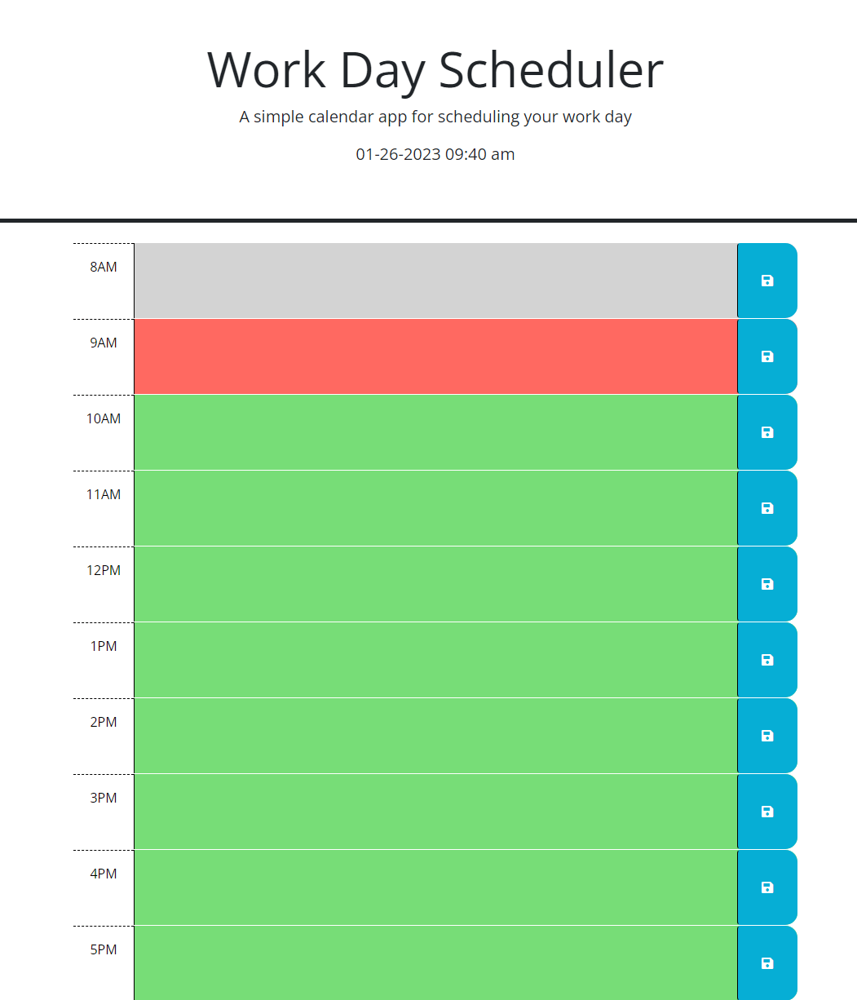

# Easy Work-Day Planner

## Description

This is a simple easy to use planner for your daily activities. The app offers a great and easy to use UI with the ability to store information locally. This allows the user to enter data, close the tab and when they return later they can open the app and still see what they entered earlier for the day. Before coming into this project I had some difficulties operating the local storage and retrieval method, but while developing the code here I gained a greater understaning of that function. As well a better understaing of using the Dayjs function.

## Table of Contents 

- [Installation](#installation)
- [Usage](#usage)
- [Credits](#credits)
- [License](#license)

## Installation

There is no installation required. Simply open the webpage in your browser.

## Usage

Once opening the webpage, the user can see all hours of their scheduled workday. Through this, they can see the current time as well at the top of the page. Looking down the calendar, any hours that have passed for the day will be shown in gray. the current hour in red, and any future hours available in green. 

The user may click on any listed time, enter text in the time slot, and then click the save button on the side. Siply close the browser and open to the same page to see what you had entered before, retrieved from local storage.

To delete any entries, simply highlight your text, erase it and save the field as blank.

md
    
    

## Credits

UToronto Bootcamp for the lessons and modules which taught the functions to create this working project

## License

MIT License

Copyright (c) 2023 TamasPinter

Permission is hereby granted, free of charge, to any person obtaining a copy
of this software and associated documentation files (the "Software"), to deal
in the Software without restriction, including without limitation the rights
to use, copy, modify, merge, publish, distribute, sublicense, and/or sell
copies of the Software, and to permit persons to whom the Software is
furnished to do so, subject to the following conditions:

The above copyright notice and this permission notice shall be included in all
copies or substantial portions of the Software.

THE SOFTWARE IS PROVIDED "AS IS", WITHOUT WARRANTY OF ANY KIND, EXPRESS OR
IMPLIED, INCLUDING BUT NOT LIMITED TO THE WARRANTIES OF MERCHANTABILITY,
FITNESS FOR A PARTICULAR PURPOSE AND NONINFRINGEMENT. IN NO EVENT SHALL THE
AUTHORS OR COPYRIGHT HOLDERS BE LIABLE FOR ANY CLAIM, DAMAGES OR OTHER
LIABILITY, WHETHER IN AN ACTION OF CONTRACT, TORT OR OTHERWISE, ARISING FROM,
OUT OF OR IN CONNECTION WITH THE SOFTWARE OR THE USE OR OTHER DEALINGS IN THE
SOFTWARE.
